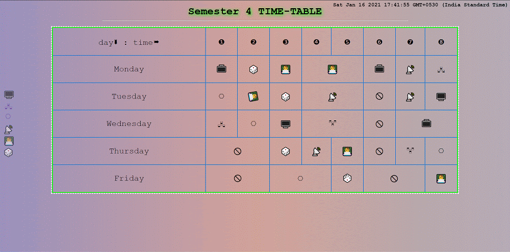

# __Collage Timetable With Flipping Cells__

The **timetable** is made using Html, Css, Js,JQuery(Library) 

## **Features**  🏹

* flliping cells ⟲
* side navigation icons 
    * to navigate to syllabus pdf of respective subject
* subjects
    * Operating System 🖥️
    * Communication System 🖧
    * Software Verification & Validation ⎔
    * Computer Networks 📡
    * Competitive Programming 👨‍💻
    * Stochastic Processes and Queuing Theory 🎲

## **How it looks** 🤓

You can see the explanatory video on [youtube](https://www.youtube.com/channel/UCCSsffoAPFq8Zd584k2ECBA)

### **License**
None 🤪